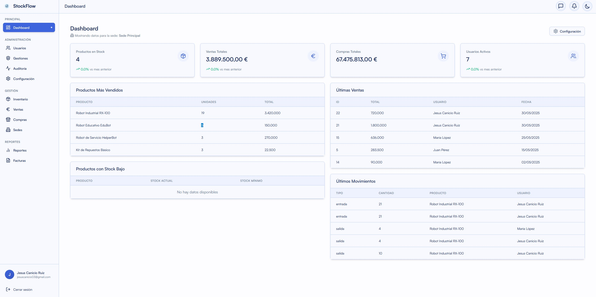
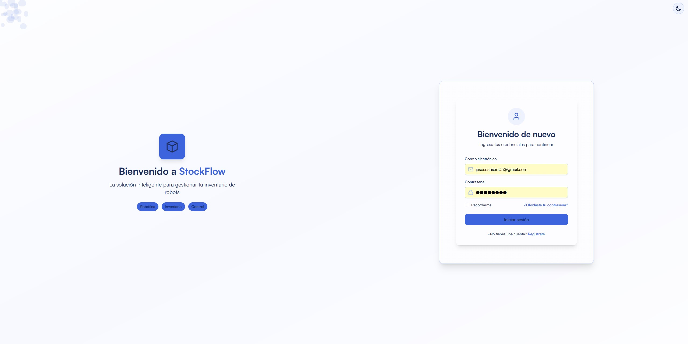
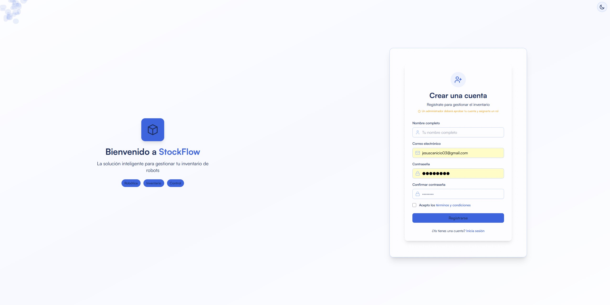
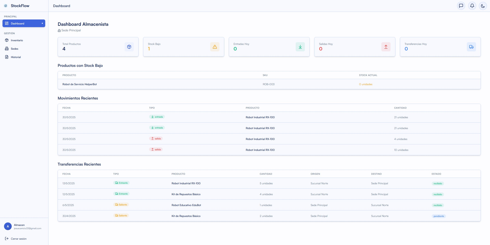

# 🤖 StockFlow - Sistema de Gestión de Inventario para Robots

<div align="center">

[](https://stockflow-demo.com)


[](https://opensource.org/licenses/MIT)
[](https://github.com/tuuser/stockflow)

[Ver Demo](https://stockflow-demo.com) • [Reportar Bug](https://github.com/tuuser/stockflow/issues) • [Solicitar Feature](https://github.com/tuuser/stockflow/issues)

</div>

## ✨ Descripción

StockFlow es una solución integral para la gestión de inventario diseñada específicamente para tiendas de robots y accesorios. Permite administrar productos, proveedores, compras, ventas y transferencias entre sedes de manera eficiente y en tiempo real.

El sistema está construido con tecnologías modernas para ofrecer una experiencia de usuario fluida y responsiva, con un diseño adaptado para dispositivos móviles y de escritorio.

## 📋 Tabla de Contenidos

- [✨ Descripción](#-descripción)
- [🚀 Características](#-características)
- [⚙️ Tecnologías](#️-tecnologías)
- [🛠️ Instalación](#️-instalación)
- [📱 Capturas de Pantalla](#-capturas-de-pantalla)
- [🔑 Endpoints API](#-endpoints-api)
- [📦 Estructura del Proyecto](#-estructura-del-proyecto)
- [📊 Modelos de Datos](#-modelos-de-datos)
- [👥 Roles y Permisos](#-roles-y-permisos)
- [📚 Documentación](#-documentación)
- [👥 Equipo](#-equipo)
- [🤝 Contribución](#-contribución)
- [📄 Licencia](#-licencia)

## 🚀 Características

### Dashboard personalizado por rol

<div align="center">
  
  
</div>

### Frontend
- 📊 **Dashboards intuitivos** para diferentes roles (Admin, Vendedor, Almacenista)
- 📱 **Diseño responsivo** optimizado para móvil, tablet y escritorio
- 🎨 **Interfaz moderna** con tema claro/oscuro y animaciones fluidas
- 📈 **Visualización de datos** con gráficos interactivos y reportes en tiempo real
- 🔍 **Búsqueda avanzada** con filtros dinámicos y sugerencias
- 🌐 **Internacionalización** con soporte para múltiples idiomas
- 🔐 **Autenticación segura** con JWT y protección de rutas

### Backend
- 🏢 **Gestión multi-sede** con transferencias de inventario entre ubicaciones
- 🔄 **Control de stock** con historial detallado de movimientos
- 📋 **Generación de facturas** en PDF con diseño personalizable
- 📊 **Reportes analíticos** para toma de decisiones
- 🛡️ **API RESTful** con documentación Swagger/OpenAPI
- 📝 **Registro de auditoría** para seguimiento de cambios
- 🔄 **Sincronización en tiempo real** entre dispositivos

## ⚙️ Tecnologías

### Frontend
- **React 19** - Framework JavaScript para construir interfaces de usuario
- **TailwindCSS** - Framework CSS para diseño rápido y responsivo
- **Zustand** - Gestión de estado simple y eficiente
- **Framer Motion** - Biblioteca para animaciones fluidas
- **React Query** - Gestión de estado del servidor y caché
- **Axios** - Cliente HTTP para realizar peticiones
- **React Router** - Navegación y enrutamiento
- **Lucide React** - Iconos modernos y personalizables

### Backend
- **Laravel 12** - Framework PHP moderno y potente
- **MySQL 8.0** - Sistema de gestión de bases de datos relacionales
- **Laravel Sanctum** - Autenticación API segura
- **Spatie Permissions** - Control de acceso basado en roles
- **Laravel Excel** - Exportación/importación de datos
- **Laravel PDF** - Generación de documentos PDF
- **Redis** - Almacenamiento en caché para mejor rendimiento
- **PHPUnit** - Framework de pruebas para PHP

### DevOps
- **Docker** - Contenedores para desarrollo y despliegue consistentes
- **GitHub Actions** - Integración y despliegue continuos (CI/CD)
- **Laravel Sail** - Entorno de desarrollo Docker optimizado
- **Vite** - Herramienta de construcción frontend ultrarrápida

## 🛠️ Instalación

### Prerrequisitos
- Docker y Docker Compose
- Node.js 18+ (para desarrollo)
- PHP 8.2+ (para desarrollo sin Docker)
- Composer (para desarrollo sin Docker)

### Usando Docker (Recomendado)
```bash
# Clonar el repositorio
git clone https://github.com/tuuser/stockflow.git
cd stockflow

# Crear archivo .env
cp .env.example .env

# Iniciar contenedores
docker-compose up -d

# Instalar dependencias y configurar la aplicación
docker-compose exec backend composer install
docker-compose exec backend php artisan key:generate
docker-compose exec backend php artisan migrate --seed
docker-compose exec frontend npm install

# Acceder a la aplicación
# Frontend: http://localhost:3000
# Backend API: http://localhost:8000
# PHPMyAdmin: http://localhost:8080
```

### Instalación Manual

#### Backend
```bash
cd backend
composer install
cp .env.example .env
php artisan key:generate
php artisan migrate --seed
php artisan serve
```

#### Frontend
```bash
cd frontend
npm install
cp .env.example .env
npm run dev
```

## 📱 Capturas de Pantalla

<div align="center">
  
  
</div>

<div align="center">
  
  <p><em>Dashboard de Almacenista con gestión de inventario y transferencias</em></p>
</div>

## 🔑 Endpoints API

### Autenticación
| Método | Endpoint | Descripción |
|--------|----------|-------------|
| POST | `/api/login` | Iniciar sesión |
| POST | `/api/register` | Registrar usuario |
| POST | `/api/logout` | Cerrar sesión |
| GET | `/api/me` | Obtener usuario actual |

### Usuarios
| Método | Endpoint | Descripción |
|--------|----------|-------------|
| GET | `/api/usuarios` | Listar todos los usuarios |
| GET | `/api/usuarios/{id}` | Obtener usuario específico |
| POST | `/api/usuarios` | Crear nuevo usuario |
| PUT | `/api/usuarios/{id}` | Actualizar usuario |
| DELETE | `/api/usuarios/{id}` | Eliminar usuario |
| GET | `/api/usuarios/trashed` | Obtener usuarios eliminados |
| POST | `/api/usuarios/{id}/restore` | Restaurar usuario eliminado |
| PATCH | `/api/usuarios/{usuario}/estado` | Cambiar estado del usuario |

### Productos
| Método | Endpoint | Descripción |
|--------|----------|-------------|
| GET | `/api/productos` | Listar todos los productos |
| GET | `/api/productos/{id}` | Obtener producto específico |
| POST | `/api/productos` | Crear nuevo producto |
| PUT | `/api/productos/{id}` | Actualizar producto |
| DELETE | `/api/productos/{id}` | Eliminar producto |
| GET | `/api/productos/stock-bajo` | Productos con stock bajo |
| GET | `/api/productos/por-sede/{sedeId}` | Productos por sede |

### Ventas
| Método | Endpoint | Descripción |
|--------|----------|-------------|
| GET | `/api/ventas` | Listar todas las ventas |
| POST | `/api/ventas` | Registrar venta |
| GET | `/api/ventas/{venta}` | Obtener venta específica |
| PATCH | `/api/ventas/{venta}` | Actualizar venta |
| DELETE | `/api/ventas/{venta}` | Eliminar venta |
| GET | `/api/ventas/por-fechas` | Ventas por rango de fechas |
| GET | `/api/ventas/resumen` | Resumen de ventas |

### Compras
| Método | Endpoint | Descripción |
|--------|----------|-------------|
| GET | `/api/compras` | Listar todas las compras |
| POST | `/api/compras` | Registrar compra |
| GET | `/api/compras/{compra}` | Obtener compra específica |
| PATCH | `/api/compras/{compra}` | Actualizar compra |
| DELETE | `/api/compras/{compra}` | Eliminar compra |
| GET | `/api/compras/por-fechas` | Compras por rango de fechas |
| GET | `/api/compras/resumen` | Resumen de compras |

### Transferencias
| Método | Endpoint | Descripción |
|--------|----------|-------------|
| GET | `/api/transferencias` | Listar todas las transferencias |
| POST | `/api/transferencias` | Crear transferencia |
| GET | `/api/transferencias/{transferencia}` | Obtener transferencia específica |
| PUT | `/api/transferencias/{transferencia}` | Actualizar transferencia |
| DELETE | `/api/transferencias/{transferencia}` | Eliminar transferencia |

### Auditoría
| Método | Endpoint | Descripción |
|--------|----------|-------------|
| GET | `/api/auditoria` | Listar registros de auditoría |
| GET | `/api/auditoria/{id}` | Obtener registro de auditoría específico |
| GET | `/api/auditoria/acciones` | Obtener acciones registradas |
| GET | `/api/auditoria/tablas` | Obtener tablas auditadas |

### Notificaciones
| Método | Endpoint | Descripción |
|--------|----------|-------------|
| GET | `/api/notifications` | Listar notificaciones |
| PUT | `/api/notifications/{id}/mark-as-read` | Marcar notificación como leída |
| PUT | `/api/notifications/mark-all-as-read` | Marcar todas como leídas |
| DELETE | `/api/notifications/{id}` | Eliminar notificación |
| DELETE | `/api/notifications` | Eliminar todas las notificaciones |

### Mensajes
| Método | Endpoint | Descripción |
|--------|----------|-------------|
| POST | `/api/messages/user` | Enviar mensaje a usuario |
| POST | `/api/messages/sede` | Enviar mensaje a sede |
| POST | `/api/messages/all` | Enviar mensaje a todos |

### Dashboard
| Método | Endpoint | Descripción |
|--------|----------|-------------|
| GET | `/api/dashboard/stats` | Estadísticas generales |
| GET | `/api/dashboard/ventas-por-mes` | Ventas por mes |
| GET | `/api/dashboard/productos-mas-vendidos` | Productos más vendidos |
| GET | `/api/dashboard/productos-stock-bajo` | Productos con stock bajo |
| GET | `/api/dashboard/ultimas-ventas` | Últimas ventas |
| GET | `/api/dashboard/ultimas-compras` | Últimas compras |
| GET | `/api/dashboard/ultimos-movimientos` | Últimos movimientos |

### Facturas
| Método | Endpoint | Descripción |
|--------|----------|-------------|
| GET | `/api/facturas` | Listar facturas |
| GET | `/api/facturas/venta/{id}` | Generar factura de venta |
| GET | `/api/facturas/compra/{id}` | Generar factura de compra |
| GET | `/api/facturas/descargar/{tipo}/{id}` | Descargar factura |

[Ver documentación completa de la API](docs/api.md)

## 📦 Estructura del Proyecto

```
stockflow/
├── frontend/          # Aplicación React
│   ├── src/
│   │   ├── components/    # Componentes reutilizables
│   │   ├── layouts/       # Estructuras de página
│   │   ├── pages/         # Páginas de la aplicación
│   │   ├── store/         # Estado global (Zustand)
│   │   ├── services/      # Servicios API
│   │   ├── hooks/         # Hooks personalizados
│   │   └── lib/           # Utilidades y helpers
│   ├── public/            # Archivos estáticos
│   └── ...
├── backend/           # API Laravel
│   ├── app/
│   │   ├── Http/Controllers/  # Controladores
│   │   ├── Models/            # Modelos Eloquent
│   │   ├── Services/          # Servicios
│   │   └── ...
│   ├── database/
│   │   ├── migrations/        # Migraciones
│   │   └── seeders/          # Seeders
│   ├── routes/               # Definición de rutas
│   └── ...
├── docker/            # Configuración Docker
├── docs/              # Documentación
└── ...
```

## 📊 Modelos de Datos

- **Usuarios**: Administradores, vendedores y almacenistas
- **Productos**: Robots, repuestos y accesorios
- **Categorías**: Clasificación de productos
- **Marcas**: Fabricantes de productos
- **Proveedores**: Suministradores de productos
- **Sedes**: Ubicaciones físicas de la empresa
- **Ventas/Compras**: Transacciones con clientes/proveedores
- **Transferencias**: Movimientos entre sedes
- **Auditoría**: Sistema completo de registro de cambios y actividades que permite seguimiento detallado de todas las operaciones en el sistema, incluyendo modificaciones de datos, acciones de usuarios, y transacciones comerciales. Implementado con Spatie Activity Log y personalizado para registrar información contextual relevante para el negocio.

## 👥 Roles y Permisos

- **Administrador**: Acceso completo al sistema
- **Vendedor**: Gestión de ventas y consulta de inventario
- **Almacenista**: Control de inventario y transferencias

## 📚 Documentación

- [Guía de Usuario](docs/user-guide.md)
- [Documentación API](docs/api.md)
- [Arquitectura del Sistema](docs/architecture.md)
- [Guía de Contribución](CONTRIBUTING.md)

## 👥 Equipo

- 👨‍💻 **Desarrollador Frontend** - [Nombre](https://github.com/username)
- 👨‍💻 **Desarrollador Backend** - [Nombre](https://github.com/username)
- 👨‍🎨 **Diseñador UI/UX** - [Nombre](https://github.com/username)

## 🤝 Contribución

¡Agradecemos todas las contribuciones! Si deseas contribuir:

1. Haz fork del repositorio
2. Crea una rama para tu característica: `git checkout -b feature/nueva-caracteristica`
3. Realiza tus cambios y haz commit: `git commit -m 'Añadir nueva característica'`
4. Sube tus cambios: `git push origin feature/nueva-caracteristica`
5. Crea un Pull Request

Por favor, lee nuestra [Guía de Contribución](CONTRIBUTING.md) para más detalles.

## 📄 Licencia

Este proyecto está bajo la Licencia MIT - ver el archivo [LICENSE](LICENSE) para más detalles.

## 👤 Copyright

Copyright © 2025 Jesús Canicio Ruiz. Todos los derechos reservados.